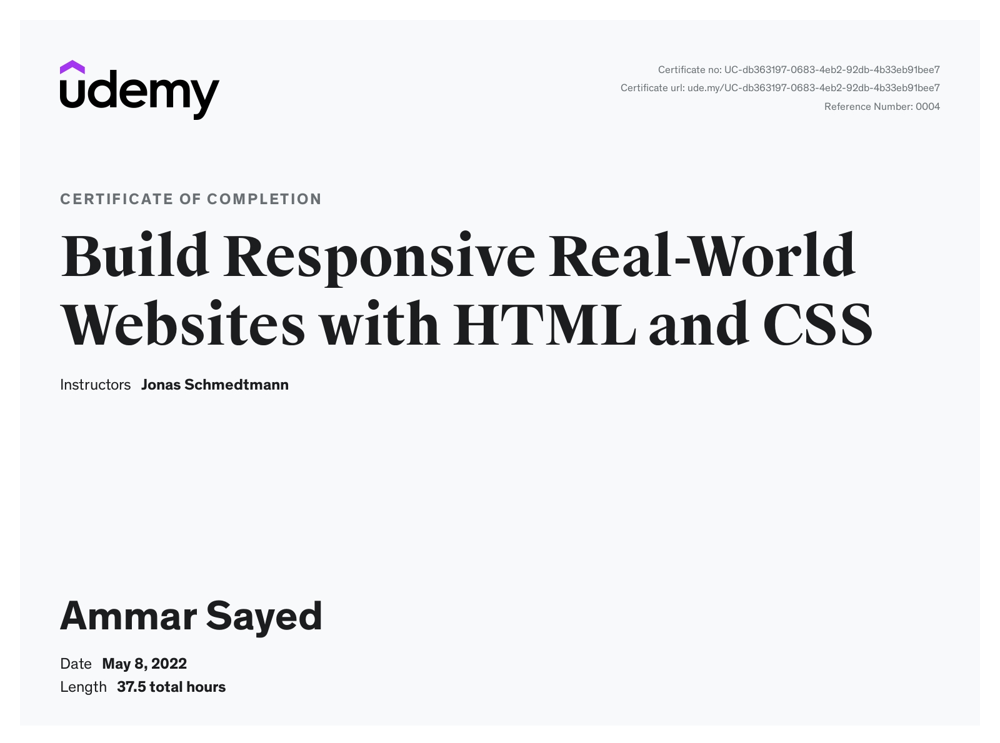

# Build Responsive Real-World Websites with HTML and CSS

## How to use

The code snapshots are organized in multiple **branches** where every branch **represents a course section**.

You can switch branches via the branch dropdown above the directory explorer.

---
[Course Linkg on Udemy](https://www.udemy.com/course/design-and-develop-a-killer-website-with-html5-and-css3)

---
[Certificate](https://www.udemy.com/certificate/UC-db363197-0683-4eb2-92db-4b33eb91bee7/)
---

---
## What you’ll learn

- Become a modern and confident HTML and CSS developer, no prior knowledge needed!
- Design and build a stunning real-world project for your portfolio from scratch
- Modern, semantic and accessible HTML5
- Modern CSS (previous CSS3), including flexbox and CSS Grid for layout
- Important CSS concepts such as the box model, positioning schemes, inheritance, solving selector conflicts, etc.
- A web design framework with easy-to-use rules and guidelines to design eye-catching websites
- How to plan, sketch, design, build, test, and optimize a professional website
- How to make websites work on every possible mobile device (responsive design)
- How to use common components and layout patterns for professional website design and development
- Developer skills such as reading documentation, debugging, and using professional tools
- How to find and use free design assets such as images, fonts, and icons
- Practice your skills with 10+ challenges (solutions included)

## Are there any course requirements or prerequisites?

- No coding or design experience necessary
- Any computer works — Windows, macOS or Linux
- You don’t need to buy any software — we will use the best free code editor in the world

## Who this course is for:

- Complete beginners who want to learn how to build a professional, beautiful and responsive website
- Students with some knowledge about HTML and CSS, but who struggle to put together a great website
- Designers who want to expand their skill set into HTML5 and CSS3

---

## Final Hosted Project [Omnifood project](https://omnifood-proj.netlify.app/)
